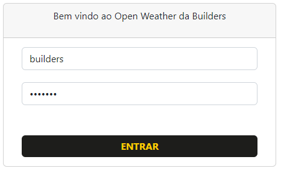
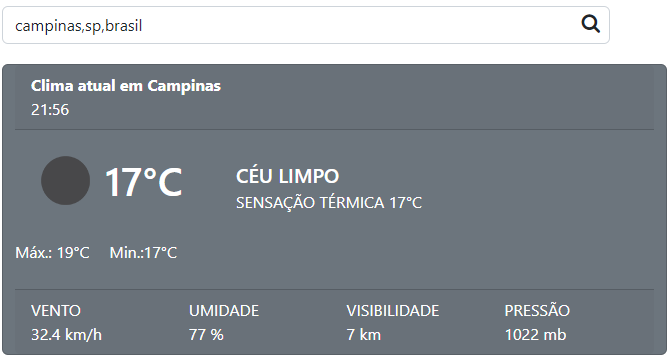
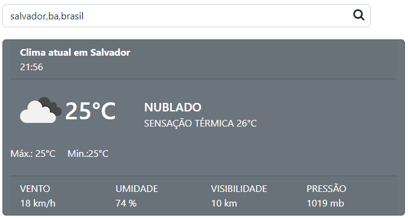
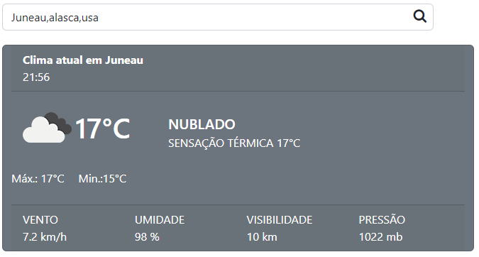

# AngularOpenWheather

# Instalar as dependências

`npm install`

## Development server

Run `ng serve` for a dev server. Navigate to `http://localhost:4200/`. The application will automatically reload if you change any of the source files.

## Running unit tests

Run `ng test` to execute the unit tests via [Karma](https://karma-runner.github.io).

## Como logar

`Usuário:` builders  
`Senha:` angular

## Como efetuar buscas climáticas

### Formatos aceitados:

- `cidade`
- `cidade,pais`
- `cidade,estado,pais`

#### Exemplos:

`cidade,estado,país:` campinas,sp,brasil

`cidade,estado,país:` salvador,ba,brasil

`cidade,estado,país:` Juneau,alasca,usa

